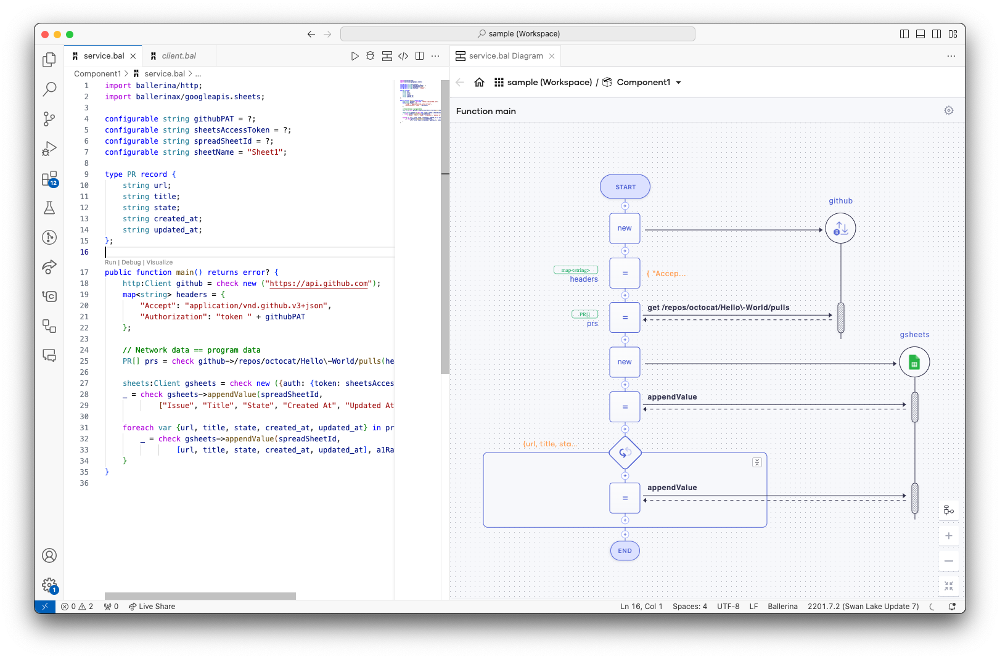
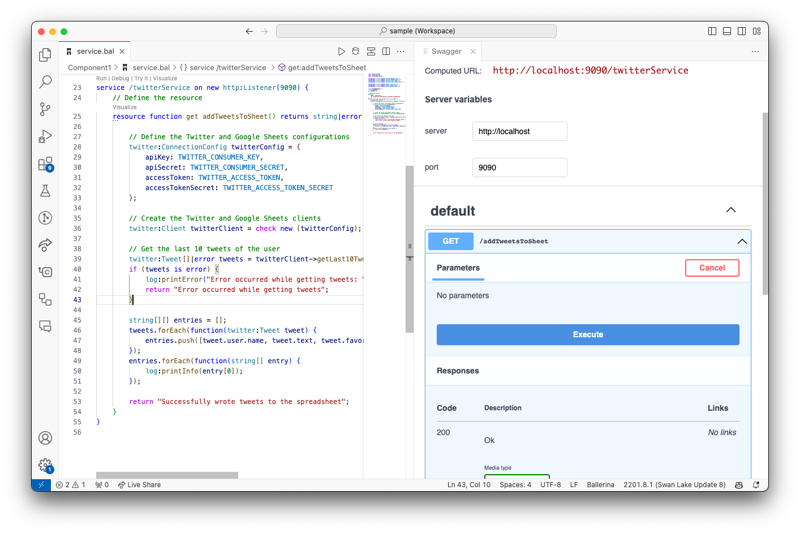
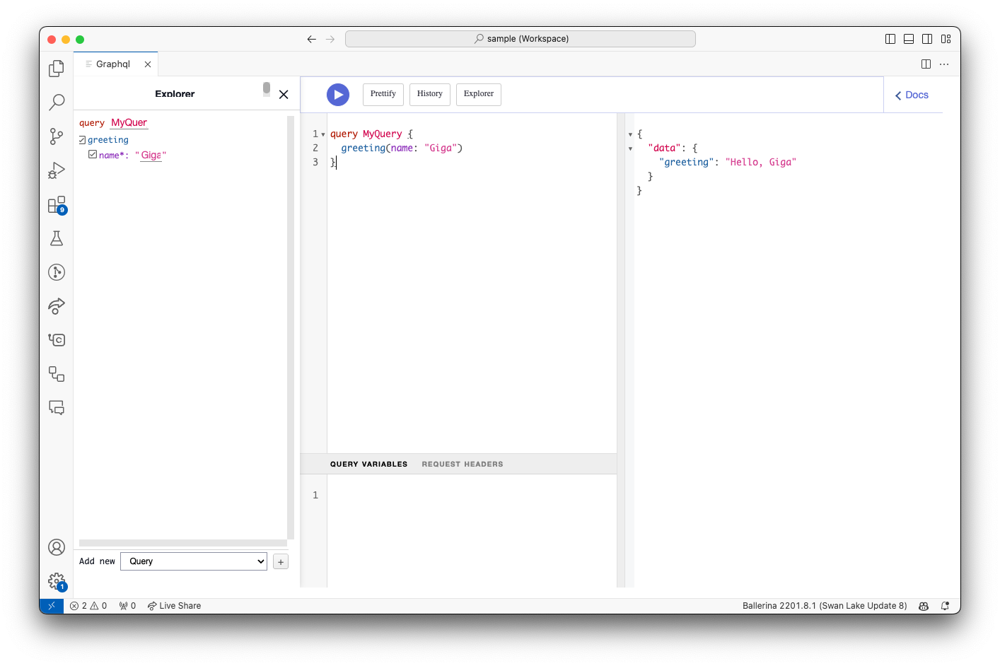

# Ballerina in Visual Studio Code
Ballerina is an open source, cloud-native programming language optimized for implementing integration solutions by providing built-in support for common enterprise integration patterns.

The Ballerina Visual Studio Code extension offers the ability to visualize the bidirectional mapping between the syntax and graphical representation of your Ballerina source code.

Apart from the built-in visual programming features, the Ballerina VS Code extension enhances the Ballerina development experience by providing a comprehensive set of other features, including code editing, debugging, code execution, and code deployment.

## Get started

To get started with the Ballerina VS Code extension:
Download and install [Ballerina](https://ballerina.io/downloads/)
Download and install [Ballerina extension](https://marketplace.visualstudio.com/items?itemName=WSO2.ballerina)
[Learn more](https://wso2.com/ballerina/vscode/docs/)

## Visual editing
### Explore the Sequence Diagram View
The visual representation provided by the Ballerina VS Code extension has its roots in sequence diagrams. They can capture how the logic of your program flows, how the concurrent execution flow works, which remote endpoints are involved, and how those endpoints interact with the different workers in the program.

[Learn more](https://wso2.com/ballerina/vscode/docs/implement-the-code/sequence-diagram-view/)

### Explore the Data Mapper view
When you map data via the user interface, the Data Mapper generates the required Ballerina source code. Since the Ballerina source code is the single source of truth for the Visual Data Mapper, it also lets you open and edit the existing data mappings made via the source code without changing the user experience.

[Learn more](https://wso2.com/ballerina/vscode/docs/implement-the-code/data-mapper/)

### Explore the Architecture View
Click the `Ballerina: Architecture View` command in the Command Palette to open the Architecture View.

Once you open the Architecture View, you will see the following types of diagrams.

Level 1 Diagram |Level 2 Diagram |Type Diagram
:-------------------------:|:-------------------------:|:-------------------------:
 |  | 

In addition to the above, the Architecture View includes the following features.

- Filter the services and types based on the packages
- Navigate to the source code from the diagram components
- Rearrange the diagram
- Export the diagrams in JPEG format

[Learn more](https://wso2.com/ballerina/vscode/docs/design-the-application/explore-the-architecture-view/)

### Explore the ER Diagram view

This module provides the ER diagram feature for persist modules. It allows developers to visualize the Entity Relationship Diagram of their persist data model definition.

### Explore the API Designer view
The HTTP API Designer and GraphQL API Designer enables you to design HTTP/GraphQL services interactively. This features allows you to design services rapidly without the need to have extensive knowledge of the syntaxes of Ballerina.

[Learn More](https://wso2.com/ballerina/vscode/docs/design-the-services):
- [HTTP API Designer](https://wso2.com/ballerina/vscode/docs/design-the-services/http-api-designer/)
- [GraphQL API Designer](https://wso2.com/ballerina/vscode/docs/design-the-services/graphql-api-designer/)

### Try the services
While you develop an HTTP/GraphQL service, you need to try and debug it to check how it works. The Ballerina VS Code extension provides the Swagger and Graphql `Try it` views, which give the ability to try HTTP/GraphQL services within VS Code instead of using any third-party software.

HTTP |GraphQL |
:-------------------------:|:-------------------------:|
 | 

[Learn more](https://wso2.com/ballerina/vscode/docs/try-the-services/)

## Language Support
### Run a program

Run the program using one of the options below.

- Click on the `Run` CodeLens on the editor.
- Click `Run` on the title bar of the editor.

[Learn more](https://www.google.com/url?q=https://wso2.com/ballerina/vscode/docs/run-a-program/&sa=D&source=docs&ust=1698893748095434&usg=AOvVaw2_Gl_ZOxQkvz-Y1WslTEok)

### Debug a program
The VS Code extension provides three types of sessions below to debug your Ballerina code.

- [`Program debug sessions`](https://wso2.com/ballerina/vscode/docs/debug-the-code/debug-sessions/#program-debug-sessions) - debug a Ballerina program
- [`Test debug sessions`](https://wso2.com/ballerina/vscode/docs/debug-the-code/debug-sessions/#test-debug-sessions) - debug a test function
- [`Remote debug sessions`](https://wso2.com/ballerina/vscode/docs/debug-the-code/debug-sessions/#remote-debug-sessions) - debug a Ballerina program that is running remotely

There are two methods to debug the above sessions.

1. Click on the `Debug` CodeLens, which appears at the top of a Ballerina program or a test function.

2. Create a `launch.json` file with the required configuration attributes (use the default configurations or edit them as required) and use either of the options below.
    1. `Ballerina Debug`
    2. `Ballerina Test`
    3. `Ballerina Remote`

### [IntelliSense](https://wso2.com/ballerina/vscode/docs/write-the-code/intellisense/)
- Code completion and snippets

The extension provides suggestions on variables, keywords, and code snippets of the language constructs (such as functions, type definitions, services, iterable constructs, etc.).

- Context-aware completion items

The completion items list is sorted based on the context of the current cursor position.

- Suggestions for service templates

Service templates corresponding to each available listener are provided in the list of completion items.

- Completion support for iterables

The `foreach` and `foreach i` completion items are provided for iterable variables.

- Completion support for type guarding a variable

The typeguard completion item is provided for union-typed variables.

- Filling required fields of a record

The completion item is provided for filling the remaining fields of a record-typed value.

- Help via hover

When hovering over a symbol name, you will be provided with quick information about the particular symbol. For example, when hovering over a function name, you will be prompted with the associated documentation.

- Signature help

When typing a function/method call expression, the signature help will show information such as the function/method call’s description and parameter information. Signature help will be triggered when typing the open parenthesis and comma.

## Next steps

This has been a brief overview of the Ballerina extension features within VS Code. For more information, see the details provided in the [official website of the Ballerina extension ](https://wso2.com/ballerina/vscode/docs/).

If you have any issues or feature requests, feel free to create an issue in Ballerina VS Code [GitHub repo](https://github.com/wso2/ballerina-vscode/issues).
